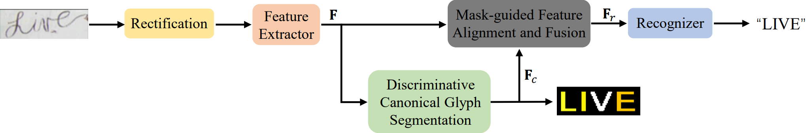
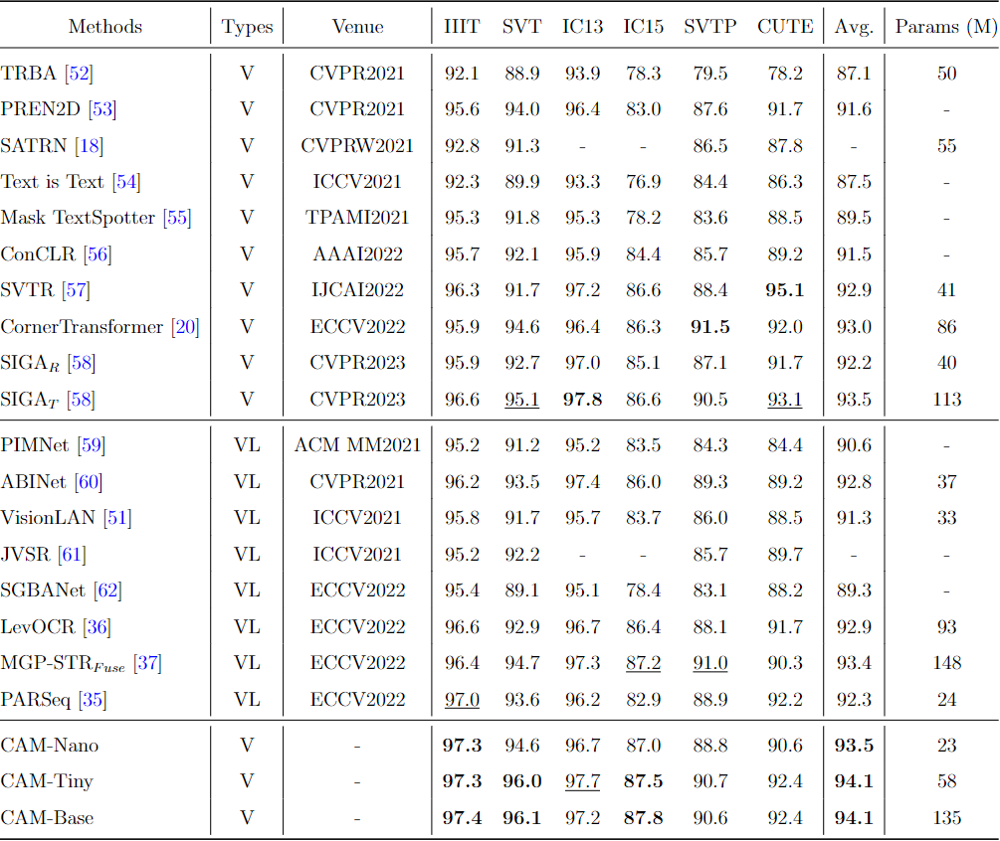

# Official PyTorch implementation of CAM

This official pytorch implementation for "Class-Aware Mask-guided feature refinement for scene text recognition".



## Data Preparation

| Data                              | path                                                         |
| --------------------------------- | ------------------------------------------------------------ |
| Synthetic Text Data               | [SynthText, Synth90k](https://pan.baidu.com/s/1BMYb93u4gW_3GJdjBWSCSw&shfl=sharepset) (Baiduyun with passwd: wi05) |
| Scene Text Recognition Benchmarks | [IIIT5k](https://1drv.ms/f/s!AlfksBYj8EUdgwIMnL795BslzfRt?e=ePJEVd), [SVT](https://1drv.ms/u/s!AgwG2MwdV23ckOhyQn60SzFI97IAeQ?e=Pk8rlZ), [IC13](https://1drv.ms/f/s!AlfksBYj8EUdgwAyDp6154Hj1ggj?e=AHyVIb), [IC15](https://1drv.ms/u/s!AgwG2MwdV23ckOhuy6ebkDhU3i5vcQ?e=t1XQN6), [SVTP](https://1drv.ms/u/s!AgwG2MwdV23ckOhzwW9jeK0zajRwiA?e=ibLDvC), [CUTE](https://1drv.ms/u/s!AgwG2MwdV23ckOhq0MJ4-jHDq9gFaw?e=uaxaEX), [COCOText](https://1drv.ms/f/s!AlfksBYj8EUdgn3lLOwcTO1R7QMr?e=JaPdto), [CTW](https://1drv.ms/u/s!AgwG2MwdV23ckOhp6ddoyLetHu2yaA?e=qTdZEc), [Total-Text](https://1drv.ms/u/s!AgwG2MwdV23ckOh02A7vn9kfCmuYjg?e=kkxmf6), [HOST](https://1drv.ms/u/s!AgwG2MwdV23ckOhw2Aj0lquBf3eGzA?e=pcFEth), [WOST](https://1drv.ms/u/s!AgwG2MwdV23ckOhxVi_7kppEkFMz2A?e=lKYfUY),[WordArt](https://1drv.ms/f/s!AgwG2MwdV23ckPNJmbcmTRfFTJrW7A?e=oq5q3z) |


## Checkpoint

You can download different version of our model in the link below.
[Base](https://1drv.ms/f/s!AgwG2MwdV23ckYQr-8RSWc8nzA3Hbg?e=ETPDWf)
[Nano](https://1drv.ms/f/s!AgwG2MwdV23ckYQqFMAZ4ezWm2fTAw?e=IAkn9P)
[Tiny](https://1drv.ms/f/s!AgwG2MwdV23ckYQsrviL0PsHrwAPuw?e=LK22hK)
## Setup

```bash
conda create -n cam python=3.8 -y
conda activate cam
pip install -r requirements.txt
```


## Run

1. Train

   ```bash
   bash script/train.sh
   ```

2. Evaluation

   - modify the  script/eval_tiny.sh ,change the ''path_to_pth'' to your own path, which is similar to eval_nano.sh and eval_base.sh

   ```bash
   bash script/eval_tiny.sh
   ```

## Result



## Citation

```
@article{yang2024class,
  title={Class-Aware Mask-guided feature refinement for scene text recognition},
  author={Yang, Mingkun and Yang, Biao and Liao, Minghui and Zhu, Yingying and Bai, Xiang},
  journal={Pattern Recognition},
  volume={149},
  pages={110244},
  year={2024},
  publisher={Elsevier}
}
```

This repository is built upon [ConvNeXt-V2](https://github.com/facebookresearch/ConvNeXt-V2), thanks very much!
